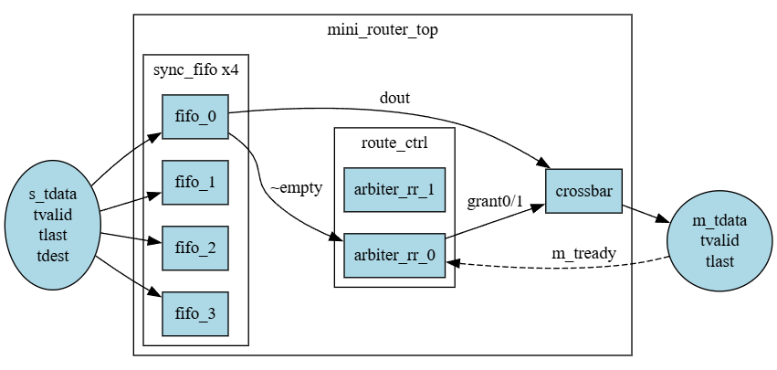

# Mini Router Design Specification

**Document Version:** 1.3  
**Status:** Released  
**Author:** Design Team  
**Date:** 2026-04-04

---

## 1. Overview

The `mini_router_top` is a 4-input × 2-output AXI-Stream packet router.  
It receives AXI-Stream packets from 4 upstream input ports and routes them to one of 2 downstream output ports based on the `tdest` signal.  
Each input port has an internal FIFO for buffering. Arbitration between competing input ports is performed independently per output port using a Round-Robin algorithm.

---

## 2. Block Diagram

```
Input Ports (×4) → sync_fifo (×4) → route_ctrl (arbiter_rr ×2) → crossbar (4×2) → Output Ports (×2)
```



---

## 3. Parameters

| Parameter   | Default     | Description                                          |
|-------------|-------------|------------------------------------------------------|
| D_WIDTH     | 8           | Data width (bits)                                    |
| FIFO_DEPTH  | 4           | FIFO depth (entries)                                 |
| FIFO_WIDTH  | D_WIDTH + 4 | Internal FIFO word width: {tdata, tid, tdest, tlast} |

---

## 4. Interface Specification

### 4.1 Global Signals

| Port   | Direction | Width | Description      |
|--------|-----------|-------|------------------|
| clk    | input     | 1     | System clock     |
| rst_n  | input     | 1     | Active-low reset |

### 4.2 Slave Side (Upstream → mini_router)

| Port         | Direction | Width   | Description                         |
|--------------|-----------|---------|-------------------------------------|
| s_tdata_0~3  | input     | D_WIDTH | Input data, port 0~3                |
| s_tid_0~3    | input     | 2       | Transaction ID per input port       |
| s_tdest_0~3  | input     | 1       | Destination port select per port    |
| s_tlast_0~3  | input     | 1       | Packet end indicator per input port |
| s_tvalid_0~3 | input     | 1       | Valid signal per input port         |
| s_tready_0~3 | output    | 1       | Backpressure to upstream            |

### 4.3 Master Side (mini_router → Downstream)

| Port         | Direction | Width   | Description                      |
|--------------|-----------|---------|----------------------------------|
| m_tdata_0~1  | output    | D_WIDTH | Output data, port 0~1            |
| m_tid_0~1    | output    | 2       | Transaction ID per output port   |
| m_tlast_0~1  | output    | 1       | Packet end indicator per output  |
| m_tvalid_0~1 | output    | 1       | Valid signal per output port     |
| m_tready_0~1 | input     | 1       | Backpressure from downstream     |

---

## 5. Protocol Description

This block uses **AXI-Stream (AXI4-Stream, IHI0051B)** protocol on both slave and master sides.

### 5.1 Handshake Rule

- A transfer (beat) occurs when **both `tvalid` and `tready` are asserted** on the same rising clock edge.
- Once `tvalid` is asserted, it shall remain asserted until the handshake completes (`tready=1`).
- `tdata`, `tlast`, `tdest`, `tid` shall remain stable while `tvalid` is asserted and `tready` is not yet asserted.
- `tready` may be asserted or deasserted freely regardless of `tvalid`.

### 5.2 Packet Boundary

- A packet consists of one or more beats.
- The last beat of a packet is indicated by `tlast=1`.
- `tdest` and `tid` shall remain stable for all beats within the same packet.

### 5.3 Routing Rule

- `s_tdest[n] = 0` → packet is routed to output port 0 (`m_tdata_0`)
- `s_tdest[n] = 1` → packet is routed to output port 1 (`m_tdata_1`)

---

## 6. Internal Signal Structure

### 6.1 FIFO Packed Format

All signals entering the FIFO are packed into a single word:

```
FIFO word = {tdata[D_WIDTH-1:0], tid[1:0], tdest[0], tlast[0]}
           = [FIFO_WIDTH-1:4]    [3:2]      [1]        [0]
```

- `FIFO_WIDTH = D_WIDTH + 4` (tdata + tid(2) + tdest(1) + tlast(1))

---

## 7. Sub-module Descriptions

### 7.1 sync_fifo (×4)

- One FIFO per input port, parameterized by `FIFO_DEPTH` and `FIFO_WIDTH`.
- **FWFT (First Word Fall Through):** Output is combinational (`assign tdata_out = fifo[rptr]`). No read latency.
- Write enable: `s_tvalid & s_tready` (= `s_tvalid & ~fifo_full`)
- Read enable: `(grant_0[n] && m_tready_0) || (grant_1[n] && m_tready_1)` (beat-level)
- `s_tready[n] = ~fifo_full[n]` (AXI-S backpressure)
- Full condition: `wptr[MSB] != rptr[MSB] && wptr[MSB-1:0] == rptr[MSB-1:0]`
- Empty condition: `wptr == rptr`

### 7.2 route_ctrl

- Generates `req_0[3:0]` and `req_1[3:0]` from FIFO empty flags and stored `tdest`.
  - `req_0[n] = ~fifo_empty[n] && (fifo_dout[n][1] == 0)`  (tdest=0)
  - `req_1[n] = ~fifo_empty[n] && (fifo_dout[n][1] == 1)`  (tdest=1)
- Contains two independent `arbiter_rr` instances, one per output port.
- Passes `m_tready_0`, `m_tready_1` and `m_tlast_0`, `m_tlast_1` to each arbiter.

### 7.3 arbiter_rr

- Round-Robin arbitration among 4 requesters.
- Output `grant[3:0]` is one-hot encoded.
- Grant updates at **packet boundary** only: `ready && last` condition.
- When no request exists after packet end: `grant <= 4'b0000`.
- **Self-reassignment prevention:** Current grant port excluded from RR candidate check.
- When `ready = 0`: grant is held (stall).

### 7.4 crossbar (4×2)

- Pure combinational MUX-based switch.
- Selects `tdata`, `tid`, `tdest`, `tlast`, `tvalid` from FIFO outputs based on `grant_0` and `grant_1`.
- Independently routes to output port 0 and output port 1.
- No registers; zero latency.

---

## 8. Functional Requirements

### 8.1 Normal Routing

- **[REQ-ROUTE-01]** The router shall route a packet to output port 0 when `tdest=0`.
- **[REQ-ROUTE-02]** The router shall route a packet to output port 1 when `tdest=1`.
- **[REQ-ROUTE-03]** All 4 input ports shall be able to send packets simultaneously.
- **[REQ-ROUTE-04]** Each packet shall be delivered to the correct output port without data corruption.
- **[REQ-ROUTE-05]** `tdata`, `tid`, `tdest`, `tlast` shall be preserved through the FIFO and crossbar.

### 8.2 Backpressure

- **[REQ-BP-01]** The router shall deassert `s_tready[n]` when the corresponding input FIFO is full.
- **[REQ-BP-02]** No data shall be lost when `s_tready=0` (upstream backpressure).
- **[REQ-BP-03]** The router shall hold the current grant when `m_tready=0` (downstream backpressure).
- **[REQ-BP-04]** The arbiter shall not update `last_grant` while `m_tready=0`.
- **[REQ-BP-05]** The router shall resume normal operation after `m_tready` is reasserted.

### 8.3 Contention

- **[REQ-CONT-01]** When multiple input ports target the same output port, the arbiter shall grant one port at a time in Round-Robin order.
- **[REQ-CONT-02]** Losing ports shall remain pending until the current granted packet ends (`tlast`).
- **[REQ-CONT-03]** The two output port arbiters shall operate independently without interference.
- **[REQ-CONT-04]** No data loss shall occur during contention.

### 8.4 Starvation Prevention

- **[REQ-STARV-01]** Every input port that continuously requests the same output shall eventually be granted in Round-Robin order.
- **[REQ-STARV-02]** A port sending a long burst shall not permanently block other ports; grant shall transfer after `tlast`.

### 8.5 Reset Behavior

- **[REQ-RST-01]** All internal registers (`grant`, `wptr`, `rptr`) shall be cleared to 0 upon `rst_n=0`.
- **[REQ-RST-02]** The router shall recover to normal operation after `rst_n` is deasserted.
- **[REQ-RST-03]** A packet transfer interrupted by reset shall not leave residual data affecting subsequent transfers.

---

## 9. Performance Requirements

### 9.1 Throughput

- **[REQ-PERF-01]** A single input port shall achieve back-to-back packet transmission with no idle cycles between packets (100% throughput).
- **[REQ-PERF-02]** All 4 input ports sending simultaneously shall achieve aggregate throughput of ≥ 90% per output port.

### 9.2 Latency

- **[REQ-PERF-03]** Minimum end-to-end latency (no contention, no backpressure) shall be ≤ 3 clock cycles from first `s_tvalid&&s_tready` to first `m_tvalid&&m_tready`.
- **[REQ-PERF-04]** Maximum latency under full contention (4 ports, FIFO_DEPTH=4 beats) shall be bounded to ≤ 16 clock cycles.

---

## 10. Timing

| Path                     | Latency | Note                             |
|--------------------------|---------|----------------------------------|
| FIFO write               | 1 cycle | Data stored on next posedge      |
| FIFO read (FWFT)         | 0 cycle | Combinational output             |
| Arbitration (arbiter_rr) | 1 cycle | Registered grant output          |
| Crossbar                 | 0 cycle | Pure combinational               |
| End-to-end (min)         | 1 cycle | FIFO write → FWFT out → crossbar |

---

## 11. Corner Case Handling

| Scenario                          | Expected Behavior                                              |
|-----------------------------------|----------------------------------------------------------------|
| FIFO full on all input ports      | All `s_tready` deasserted; no data accepted until space available |
| `m_tready=0` during packet transfer | Grant held; FIFO read suppressed; packet resumes after tready=1 |
| `rst_n=0` during active transfer  | All registers cleared; clean state after rst_n=1              |
| All 4 ports target same output    | RR arbitration; one port granted per packet; others pending    |
| Single port sends max-length burst | Other ports blocked until `tlast`; grant transfers after tlast |
| `tdest` changes mid-packet        | Undefined behavior; `tdest` must remain stable within a packet |

---

## 12. Known Limitations / Out of Scope

- `tdest` must remain stable within a packet (per beat); not re-sampled mid-packet.
- `tid` is stored in FIFO but TID-based packet interleaving is not supported; contention scenarios are limited to one packet per port sequentially.
- No support for multicast (one packet to both outputs simultaneously).
- No packet ordering guarantee across different input ports targeting the same output.
- FIFO overflow protection: write is suppressed when full, but no error flag is exposed at top level.
- No QoS or priority mechanism beyond Round-Robin.
- `m_dest_0`, `m_dest_1` (crossbar outputs) are not connected at top level.

---

## 13. Verification Considerations

The following scenarios are recommended for functional verification based on this specification:

- **Normal Routing:** Single port routing to each output; all 4 ports simultaneous routing with mixed tdest.
- **Backpressure:** Upstream FIFO full condition; downstream `m_tready=0` stall and release.
- **Contention:** 2-port and 4-port contention on same output; simultaneous contention on both outputs.
- **Starvation:** Round-Robin fairness check; long burst blocking other ports.
- **Reset:** Reset during idle; reset during active packet transfer and clean recovery.
- **Performance:** Max throughput (single port / all ports); min latency and bounded latency under contention.

> Each requirement `[REQ-*]` in Section 8~9 shall be covered by at least one test case in the Verification Plan.